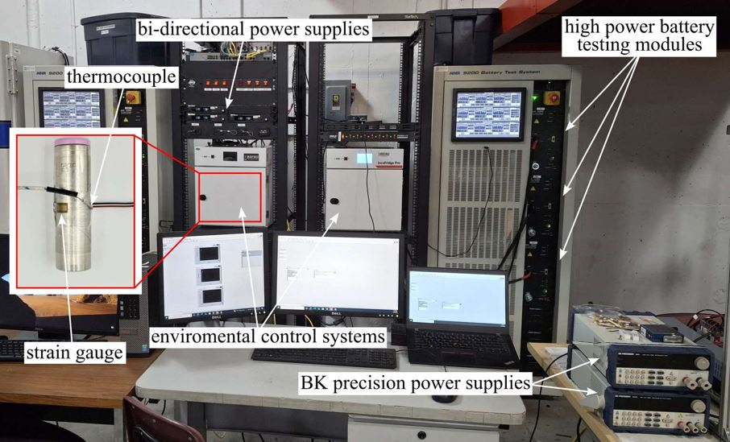

# ⚠️ Development Notice — Deprecated
⚠️ This repo is deprecated. We refactored this codebase to separate hardware targets into dedicated repositories. This creates clear “air-breaks” between setups and simplifies maintenance. Active development for specific hardware now lives here: [Battery-Testing-Software-NHR](https://github.com/ARTS-Laboratory/Battery-Testing-Software-NHR) and [Battery-Testing-Software-ITECH](https://github.com/ARTS-Laboratory/Battery-Testing-Software-ITECH). In the future, this repository will be archived. 

# Battery-Testing-Software
Software efforts developed for the USC high-power battery testing facility. 

Figure 1: USC High Power Battery Testing Facility.

## Drivers
Low-level drivers

## Device Interface Layer
Common building blocks that work with drivers

## Control Applications
The battery test applications 

## LabVIEW Tutorial
A video example of how to set up the battery testing software is posted [here](https://www.youtube.com/watch?v=4ohZ9Rowb2g&ab_channel=ARTS-LabattheUniversityofSouthCarolina) and is also in the "media" directory in this repository. 

<video src="media/Battery_Test_Tutorial_Aug_2025.mp4" controls width="600"></video>

## License
This work is licensed under a Creative Commons Attribution-ShareAlike 4.0 International License [cc-by-sa 4.0].

